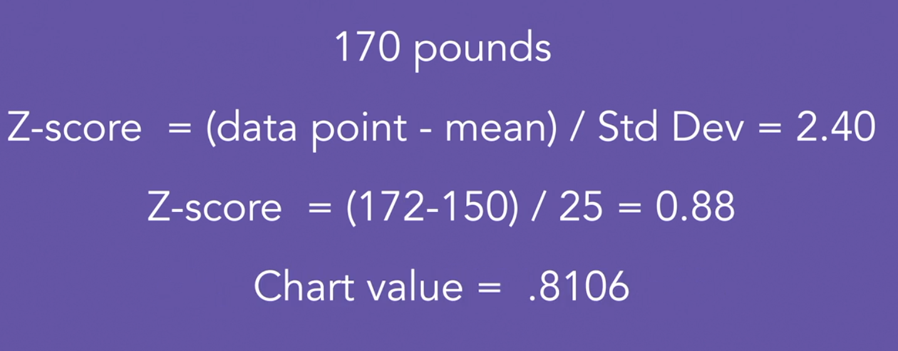

# Stat Fundamental

## Mean

## Medium

## Standard Deviation

Average distance between data points and mean

$$std = \sqrt{\frac{1}{n-1}\sum_{i=0}^N (x - \overline{x})^2}$$

## Normal distribution

normal distributed = symmetric distributed

68-95-99.7
> 68 percent of the data points lies in one standard deviation range on both side

## z-score

Z-score are a measure of the number of standard deviation a particular data point is from the mean

$$z-score = \frac{x_i - \overline{x} }{std} $$
$$ x_i = data point $$

## percentile

$$\frac{\text(\# \space of \space values \space below \space x) + 0.5}{\text(total \space \# \space of \space values)} *100 $$

## Independent vs dependence event

|   |Head   |Tail   |   Total|
|---|---|---|---|
| RAIN  | 15   | 15  | 30  |
|  SHINE |  35 | 35  | 70  |
|   TOTAL|  50 | 50  | 100  |

15 days out of 100 rain and Flipped head = 15%

$$\frac{15}{50} * \frac{15}{30} = 0.50 * 0.33 = 15\% $$

Because they are both 15% so this is an independent event

## type of probability

- Objective probability (calculatable)
  - classical probability (coin toss)
  - empirical probability
- subjective probability

## bayes theorem and false positive  <-Need more work->

$$P(A|B) = \frac{P(B|A)*P(A)}{\sum_{j} P(B|A_j) P(A_j)}$$

> example 1: only 1% people have the disease. If tested positive 99% chance it is positive. 2% of healthy patient will get a positive

> example 2: Rich people. What is the probability that a millionair did not complete high school, given that they earned their wealth

$$0.031 = \frac{(.05) * (.50)}{(.05 * .5) + (.15*.8)+(.6*.8) + (.2*.85)}$$

## Permutation vs Combination

- Combination has no order

## Permutation

$$n! / (n-x)! $$

- n = total number of objects
- x = number of objects to be selected

## Combination

$$n! / [(n - x)! * x!]$$

- n = total number of objects
- x = number of objects chosen at one time

## Binomial Experiment

> three people, each people have 20% chance of joining. What are the chances only one will join the organization

> 3 different scenario, where one join and 2 doesn't 
0.2 * 0.8 * 0.8 = 12.8%
3 * 12.8% = 38.4%

> n = number of trial
> p = chance of success (0.20)
> k = number of success

Binomial probability tables

## Fuzzy Central Limit Theorem <-Need more work->

Data influenced by many small and unrelated random effects are normally distributed.

## using the z-transform to find probabilities

> we assume that the data is normally distributed, what percentage of men, weigh more than 211 pounds. We also know mean is 150 and std is 25. 

So Our z is 2.44 = (211-150)/25 = 2.44

According to our mean and standard deviation, 99.27% of men weight 211 pounds or less

> Extend: what is the probability that a men weight less then 170 but more than 140

z-score for 170 = 0.816
z-score for 140 = 1 - 0.6554 = 0.3446

so between the two = 78.81 - 34.46 = 44.35%
