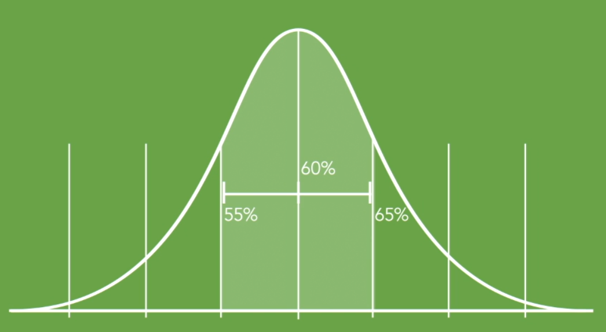
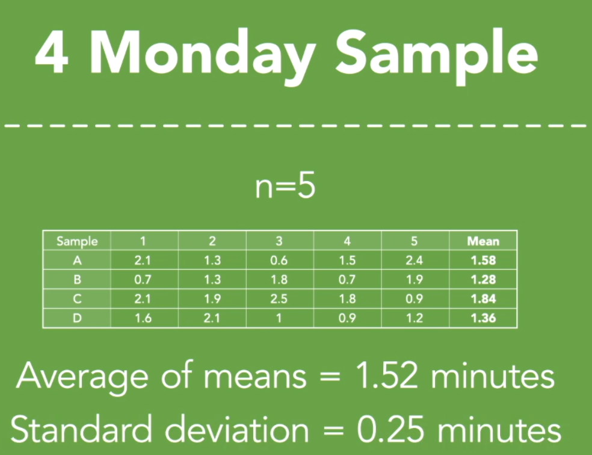
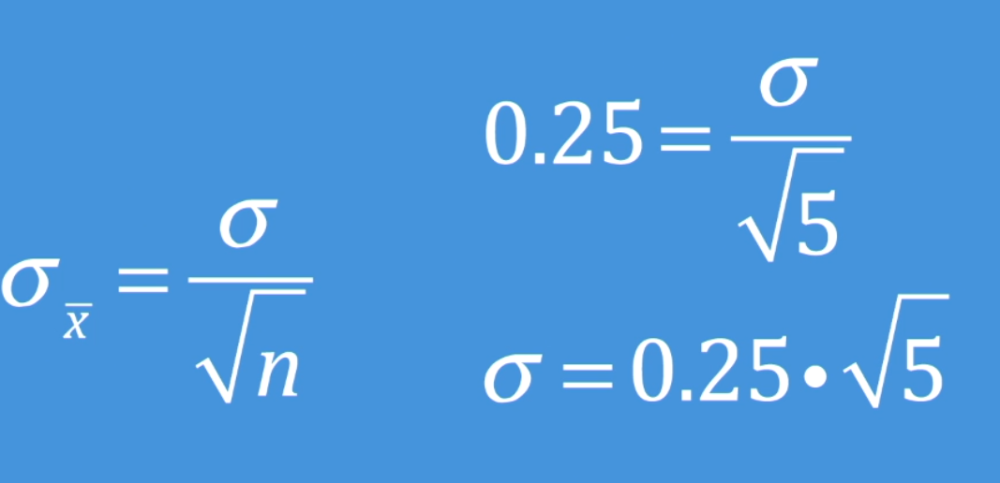
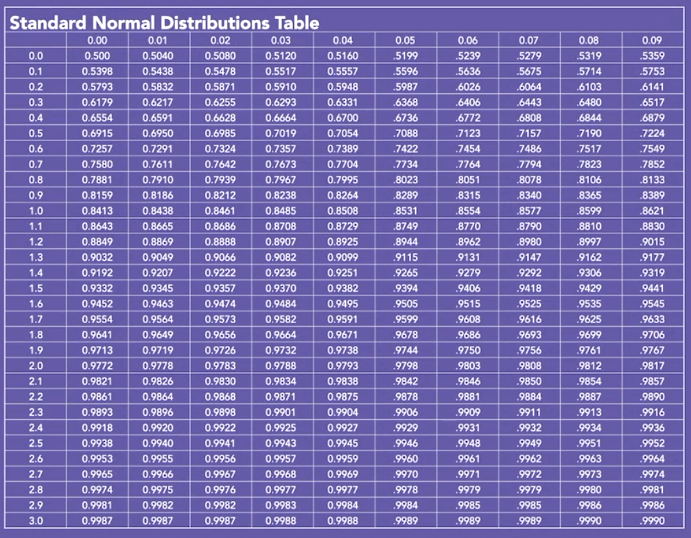
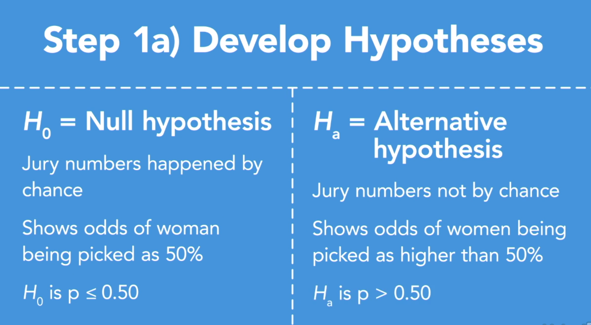
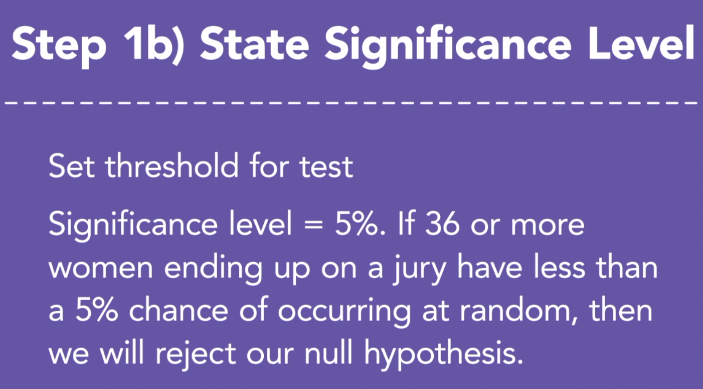
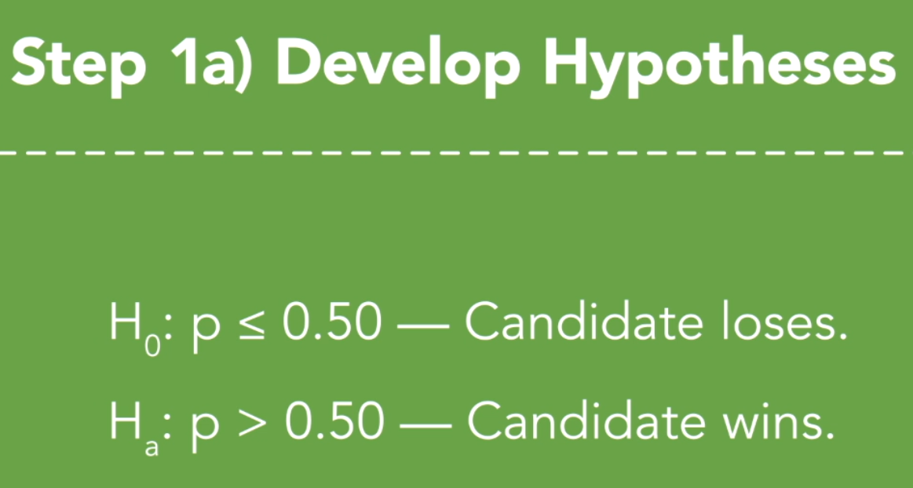
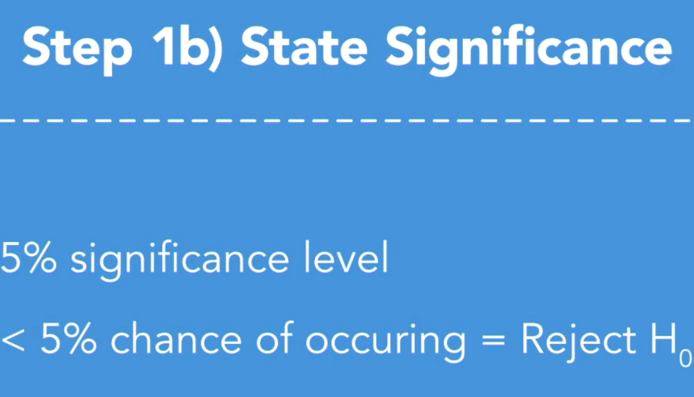
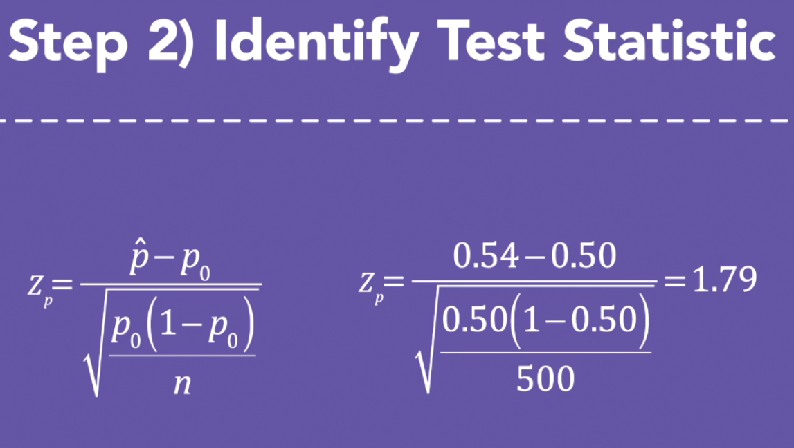

# stat 2

## Simple Random Sample

- unbiased sample
- independent data points

Alternative Method

- systematic sample (choose first one then every k unit after) 
- Opportunity Samples (take first n unit)
- stratified sample (broken into group)
- cluster sample(this is mixed, stratified is same type)

## Binomial Experiment

> magic fork machine that produce 0.9 good fork. There is no way we can know p until all the forks are created which is impossible. p hat is 0.8

p hat

$$ \hat{p} = \text(acceptable \space mean) $$

$$std_{\hat{p}} = \sqrt{\frac{p(1-p)}{n}}$$

## Standard error (for proportions)

The standard error is the standard deviation of our proportion distribution. 
Upper limit = p + std
lower = p - std

> 5% of standard deviation calculated using above formular, so 60-5 = 55 is the lower limit and 65 is the higher.Center is population proportion(generally denoted by P is a parameter that describes a percentage value associated with a population)

Beyond limits

- Unique environment
- Flaw in reported national average
- Flaw in data gathering techniques
- Market change

## Standard error (for mean)

> relationship between standard error between meean and proportion. If we use larger sample sizes, our standard error gets smaller

## confident Intervals

> took a poll, and 55% selected candidate A and 45% selected Candidate B. 100 voters. 95% confident interval.

Z-scores tell us how many standard deviations away from the mean we would need to be to capture a certain percentage of the total distribution. If we want 95% confidence level, that would mean 2.5% of the area under the curve on both side would not be included. 

$$z-score = \frac{x_i - \overline{x} }{std} $$
$$ x_i = data \space point $$

> we found 0.9750, which mean 97.5%(100-2.5 according to above) of the data points is on the left of the point and 2.5% on the right. our z-score is 1.96. 97.5

Sample proportion = 0.55

upper limit = 0.55 + 1.96 * std

lower limit = 0.55 - 1.96 * std

Polling Issues:

- lying
- change of mind
- unsure respondents
- not a random sample
- biased organization

## Hypothesis Testing

Town Population = 35000
Percentage men = 50%
Percentage Women = 50%
n = 50 (14 men 36 woman)

Step 2 Identify Test Statistic

Binomial Probability
p = 0.5
n = 50
success = 36 

Step 3 Determin P-Value

Looking for the probability that the number of women chosen for the jury-panel would be 36 or more.

Probability = 0.13% (huh?)

Step 4 Compare P-value to significance level

There was only a 0.13% chance that at random 36 or more women would be chosen for a panel of 50 potential jurors.

- alpha = 0.05 or 5%

p-value < significance level

it much more likely for a women to be chosen versus a man

## One-tailed vs two-tailed tests

Two tailed tests if we are testign for both tail end

## significance test for proportions

p hat is the sample proportion
p sub zero is the proportion from our null hypothesis
n is sample size

get p-score

https://pro.arcgis.com/en/pro-app/tool-reference/spatial-statistics/what-is-a-z-score-what-is-a-p-value.htm